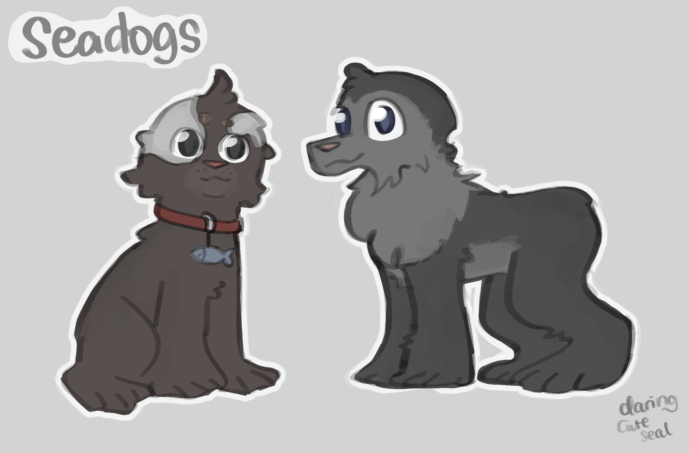
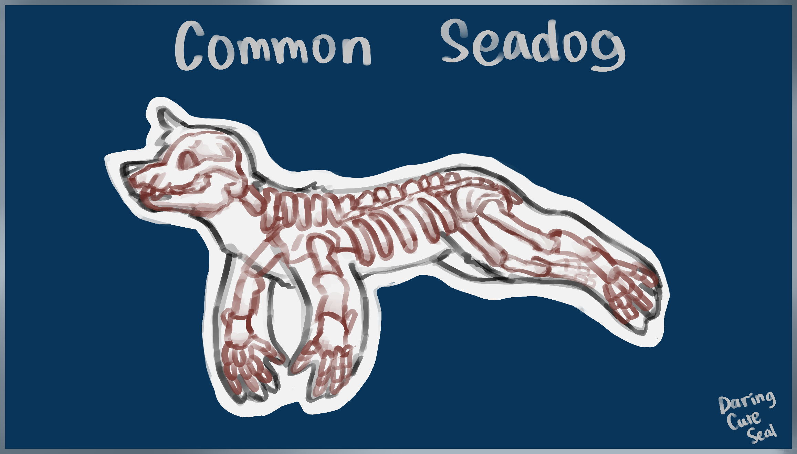
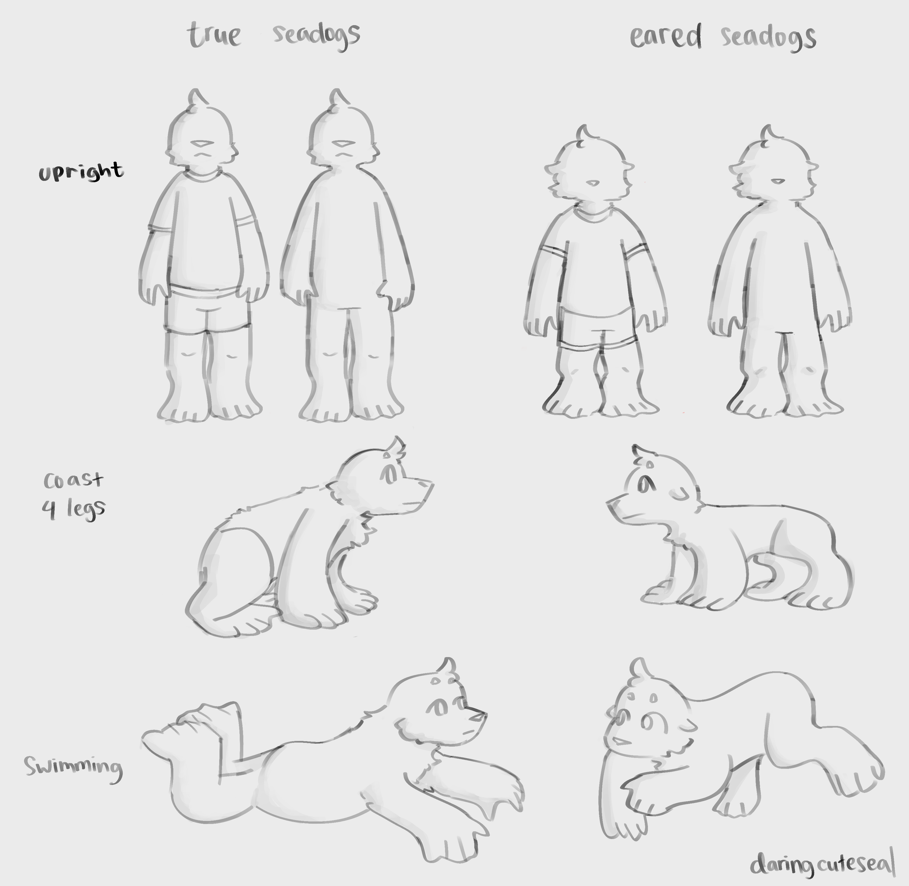

Seadogs are species of seal. They are semiaquatic, dog-like creatures who wander around coasts of mostly tropical places. [Pearl](pearl.png) is a true seadog (with slightly longer arms than average!).

# Morphology

Seadogs are covered in thick fur, with flippers similar to any other seals. They have four true fingers on each of their limbs, with a little stub finger that points inwards—usually not visible. Seadogs have very mobile back flippers that are much longer than seals, allowing them to walk in all four limbs on land. Their limbs are occupied with stretchy muscles, allowing them to stretch their limbs up to 10% longer or shorter than their original length. This is useful as it provides them with more mobility.

Seadogs can also walk upright on two "legs", although this is quite uncommon. This bipedalistic behaviour can be learned and seadogs can adapt to it, sometimes even struggling to walk again on four limbs. When they walk upright, they bend their legs to support their weight. Those who walk upright usually live exclusively on land. On average, they run and walk slower than using all four limbs.

Seadogs are divided into two races: the "true seadogs" (can be referred to as simply "seadogs") and "eared seadogs". A long time ago, eared seadogs are thought to belong to their own species. However, it turns out that they are just diverged seadogs with radically different morphology, still able to reproduce with seadogs. Since then, they are known as "eared seadogs", because they have ear flaps that are distinct from true seadogs. They primarily differ only in terms of their morphology, but their habitat, diet, and behavior are similar.

Key differences between the two:

## Ear Flaps
The most obvious one, eared seadogs have ear flaps while true seadogs don't.
## Size
True seadogs are a bit bigger and taller in size than eared seadogs.

## Proportions

Without their legs bending (i.e when not walking upright), true seadogs generally have longer legs compared to their arms. As a result, they bend their hind limbs more when they walk on four.

On the other hand, eared seadogs have legs and arms with almost identical length.

## Swimming Behavior

True seadogs swim much like humans, with their hind limbs (flippers) being close together most of the time and only their flippers creating motion that propells them underwater. Meanwhile, eared seadogs do not strictly put their hind limbs close together when swimming, as their limbs are quite short.

## Muzzles
True seadogs have longer and wider muzzles compared to eared seadogs.
# Habitat
WIP

# Behavior
WIP

# Diet

WIP
